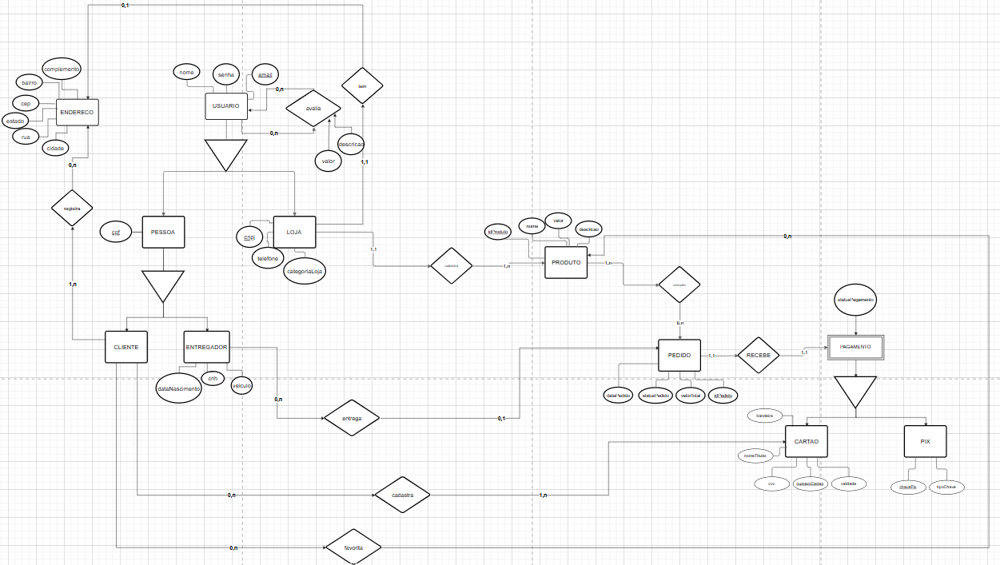

# Modelo Relacional

## Introdução

O Diagrama de Modelo Relacional é uma representação gráfica de como os dados são estruturados e scomo se relacionam em um banco de dados relacional. Ele utiliza tabelas (ou entidades) para representar conjuntos de dados e linhas conectando essas tabelas para ilustrar os relacionamentos entre elas. É útil para  facilitar o entendimento lógico do funcionamento do banco e auxilia no planejamento eficiente do banco de dados.

## Metodologia

Foi dividida uma equipe de três integrantes que ficaram responsáveis por fazer a eleboração do modelo relacional, integrantes estes descritos na **Tabela 01**.

### Tabela 01: Integrantes
| Número | Integrante |
|-------|----------|
| 1 | [Júlio Roberto da Silva Neto](https://github.com/JulioR2022) |
| 2 | [Kallyne Macedo Passos](https://github.com/kalipassos)       |
| 3 | [Wolfgang Friedrich Stein](https://github.com/Wolffstein)    |

## Diagrama do Modelo Relacional

**Disponivel em**: [Diagrama de Modelo Relacional ](https://drive.google.com/file/d/1XPdnkWzAXDTOlLEV3FFoSbgc6ncnuU2A/view?usp=sharing)

## Referências

1. DevMidia, Modelagem Relacional. Disponivel em: https://www.devmedia.com.br/modelagem-relacional/19614

## Histórico de Versão

| Versão | Data da alteração | Comentário | Autor(es) | Revisor(es) | Data de revisão |
|--------|-----------|-----------|-----------|-------------|-------------|
| 1.0 | 26/11/2024 | Criação do documento, adiciona introdução e metologia. | [Júlio Roberto da Silva Neto](https://github.com/JulioR2022) |  |  |