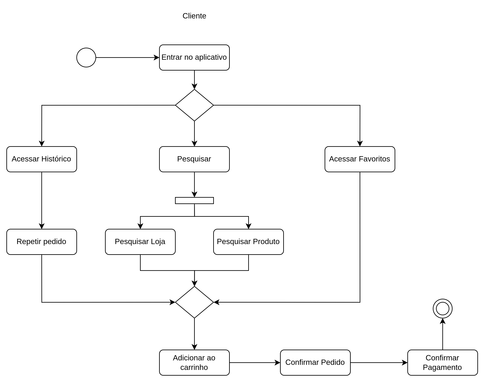

# 2.2.1 Diagrama de atividades

## Introdução

Diagrama de atividades é uma representação gráfica para descrever os fluxos de trabalho, ações e decisões dentro de um sistema ou processo. É útil para a modelar o comportamento dinâmico de um sistema/software, facilitando sua compreensão e implementação.

## Metodologia

Foi dividida uma equipe de quatro integrantes para fazer os diagramas de atividade, a tabela
mostra os responsáveis por essa tarefa:

| Numero | Integrante                                                      |
| ------ | --------------------------------------------------------------- |
| 1      | [Guilhherme Westphall](https://github.com/west7)                |
| 2      | [Gabryel Nicolas Soares de Sousa](https://github.com/gabryelns) |
| 3      | [Júlio Roberto da Silva Neto](https://github.com/JulioR2022)    |
| 4      | [Kallyne Macedo Passos](https://github.com/kalipassos)          |

**Autores**: [Júlio Roberto da Silva Neto](https://github.com/JulioR2022), [Guilhherme Westphall](https://github.com/west7)
 

## Diagramas produzidos

### Cadastro de Usuário

**Autores**: [Júlio Roberto da Silva Neto](https://github.com/JulioR2022), [Guilhherme Westphall](https://github.com/west7)

### Cliente realiza pedido

**Autores**: [Júlio Roberto da Silva Neto](https://github.com/JulioR2022), [Guilhherme Westphall](https://github.com/west7)

### Cliente avalia Entregador e Loja

### Loja recebe pedido

**Autores**: [Júlio Roberto da Silva Neto](https://github.com/JulioR2022), [Guilhherme Westphall](https://github.com/west7)

### Entregador recebe solicitação de entrega

**Autores**: [Júlio Roberto da Silva Neto](https://github.com/JulioR2022), [Guilhherme Westphall](https://github.com/west7)

## Referências

1. SERRANO, Milene. Arquitetura e Desenho de Software: Projeto e Desenho de Software. Disponível em: https://aprender3.unb.br/pluginfile.php/2928948/mod_page/content/1/Arquitetura%20e%20Desenho%20de%20Software%20-%20Aula%20Modelagem%20UML%20Din%C3%A2mica%20-%20Profa.%20Milene.pdf. Acessado em 26 de novembro de 2024.

## Histórico de versões

| Versão | Data da alteração | Comentário                  | Autor(es)                                                                                                      | Revisor(es) | Data de revisão |
| ------ | ----------------- | --------------------------- | -------------------------------------------------------------------------------------------------------------- | ----------- | --------------- |
| 1.0    | 26/11/2024        | Criação do documento        | [Guilhherme Westphall](https://github.com/west7), [Júlio Roberto da Silva Neto](https://github.com/JulioR2022) |             |                 |
| 1.1    | 26/11/2024        | Adição dos diagramas 1 ao 4 | [Guilhherme Westphall](https:github.com/west7), [Júlio Roberto da Silva Neto](https://github.com/JulioR2022)   |             |                 |
| 1.2    | 27/11/2024        | Adição do diagrama 5 | [Gabryel Nicolas Soares de Sousa](https://github.com/gabryelns)   |             |                 |