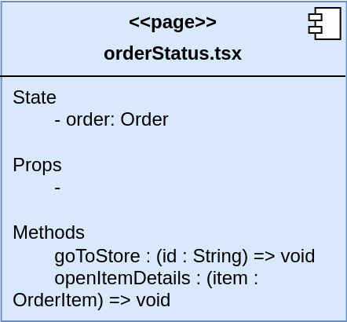
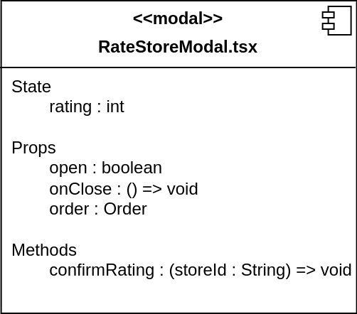
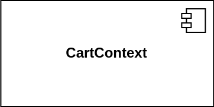
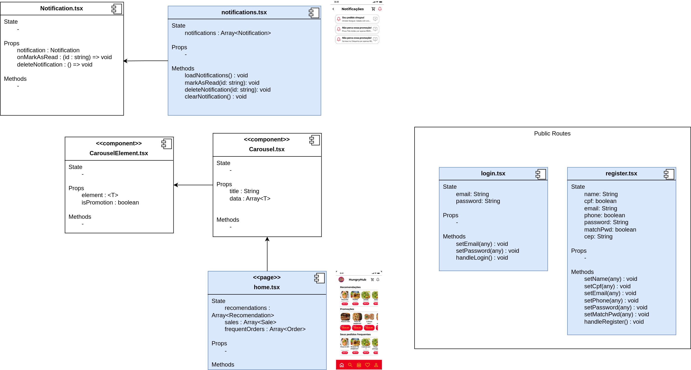
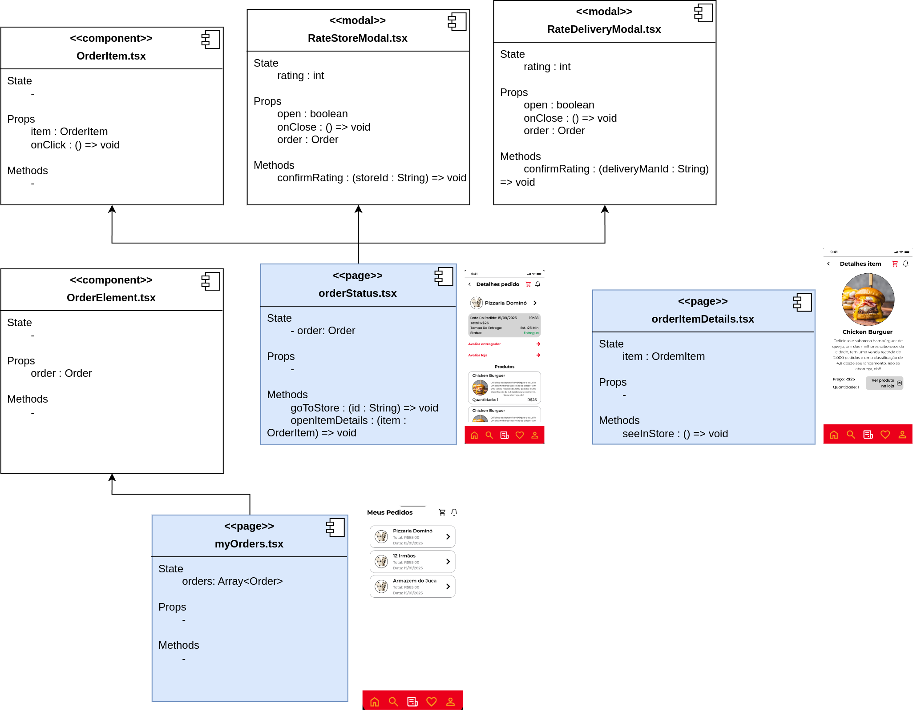
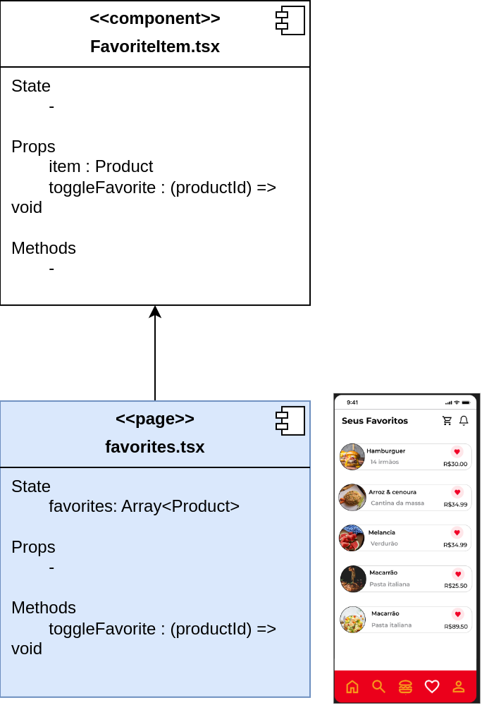
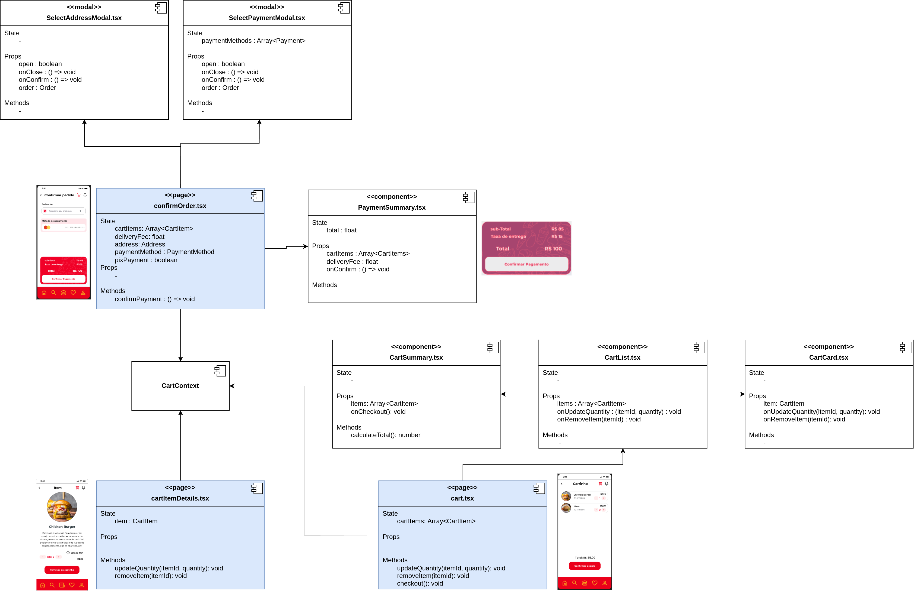
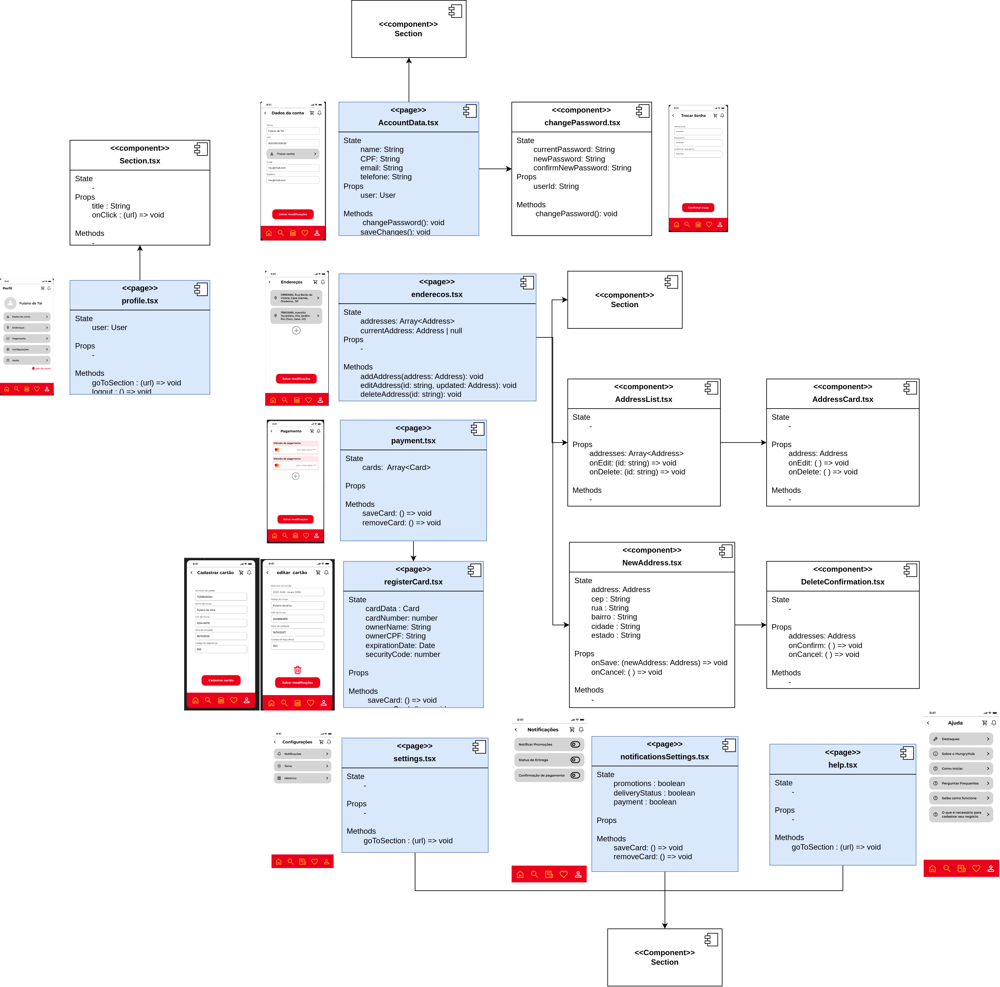

# Diagrama de Arquitetura Front-end

## Introdução

<!-- TODO -->

## Metodologia

<!-- TODO -->

| Tipo de Entidade | Descrição | Exemplo |
|--|--|--|
| **Página** | Representa uma rota individual da interface, que pode agregar outros componentes e modais |  |
| **Componente** | Bloco reutilizável de interface, responsável por renderizar partes específicas da aplicação. Pode ser funcional ou de classe, e encapsula lógica e apresentação. |  |
| **Modal** | Janela sobreposta à interface principal usada para exibir informações ou interações temporárias sem navegar para outra página |  |
| **Contexto** | Ferramenta para gerenciar estado global ou compartilhado entre vários componentes, permitindo comunicação eficiente sem passar props manualmente |  |
| **Dependência** | Representa uma relação de dependência entre duas entidades indicada pela direção da seta, ou seja, uma entidade depende ou importa uma outra entidade |  |

## Diagrama

Para melhor visualização, o diagrama foi divido em seções que individualizam partes da interface que estão mais relacionadas ou próximas entre si. Cada uma dessas sessões e seus autores podem ser encontradas a seguir:

### 1. Seção Login-Home-Notificações

**Autores**: [Felipe Amorim de Araújo](https://github.com/lipeaaraujo), [Leonardo Sobrinho de Aguiar](https://github.com/Leonardo0o0), [Guilherme Westphall de Queiroz](https://github.com/west7)

### 2. Seção Pesquisa-Detalhes

**Autores**: [Felipe Amorim de Araújo](https://github.com/lipeaaraujo), [Leonardo Sobrinho de Aguiar](https://github.com/Leonardo0o0), [Guilherme Westphall de Queiroz](https://github.com/west7)

### 3. Seção Pedidos

**Autores**: [Felipe Amorim de Araújo](https://github.com/lipeaaraujo), [Guilherme Silva Dutra](https://github.com/GuiDutra21)

### 4. Seção Favoritos

**Autores**: [Felipe Amorim de Araújo](https://github.com/lipeaaraujo), [Guilherme Silva Dutra](https://github.com/GuiDutra21)

### 5. Seção Carrinho-Pagamento

**Autores**: [Felipe Amorim de Araújo](https://github.com/lipeaaraujo), [Kallyne Macedo Passos](https://github.com/kalipassos), [Guilherme Silva Dutra](https://github.com/GuiDutra21)

### 5. Seção Perfil

**Autores**: [Felipe Amorim de Araújo](https://github.com/lipeaaraujo), [Kauan de Torres Eiras](https://github.com/kauaneiras)

## Referências

1. MUNRO, Michael. Front-end component design principles. Engineering at CarsGuide, 7 dez. 2016. Disponível em: https://engineering.carsguide.com.au/front-end-component-design-principles-55c5963998c9. Acesso em: 16 nov. 2024.

## Histórico de Versão

| Versão | Data da alteração | Comentário | Autor(es) | Revisor(es) | Data de revisão |
| -- | -- | -- | -- | -- | -- |
| 1.0 | 24/11/2024 | Criação do documento e adição da tabela de metodologia, imagens do diagrama e autorias | [Felipe Amorim de Araújo](https://github.com/lipeaaraujo) | | |
