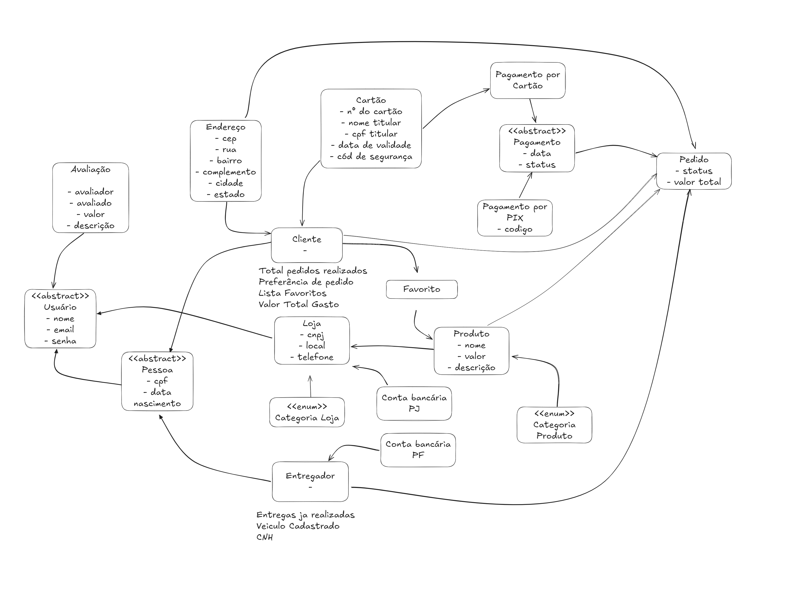
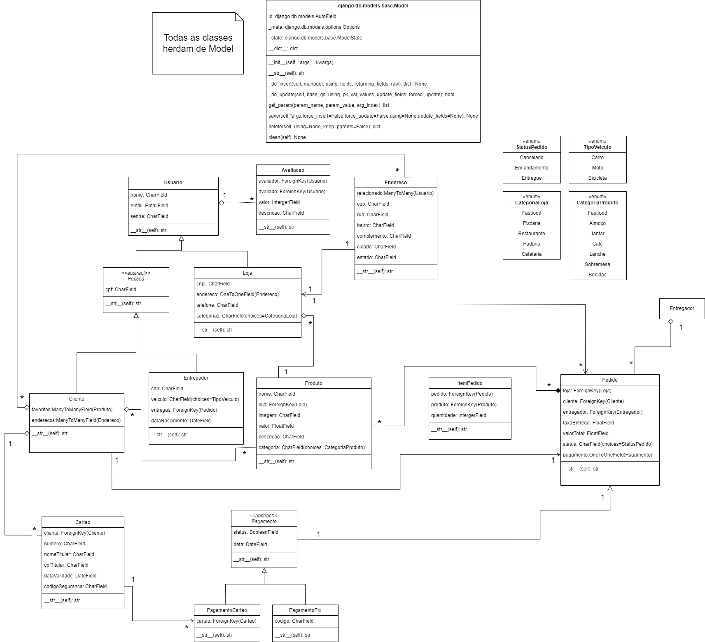

# Diagrama de Classes

## Introdução

O diagrama de classes é um artefato UML estático que fornece uma representação visual da estrutura do sistema, incluindo classes, atributos, métodos e seus relacionamentos. Ele é fundamental para o planejamento e design de um software, além se desempenhar um papel essencial na modelagem de sistemas orientados a objetos, fornecendo uma base sólida para o design e facilitando a comunicação entre os membros da equipe.

## Metodologia

Este diagrama foi desenvolvido utilizando a linguagem de modelagem unificada (UML), seguindo a estrutura e os padrões descritos em aula e priorizando clareza na representação dos elementos e suas relações. No diagrama, uma classe é representada por um retângulo dividido em três partes, em que a primeira parte contém o nome representativo da classe, a segunda contém os atributos, que são propriedades dos objetos representados pela classe, e a última parte possui os métodos, que descrevem o comportamento da classe. Os relacionamentos entre as classes podem ser de diferentes tipos, como dependência, associação, agregação, composição, generalização e realização.

> **Observação**: Fizemos uma modificação no diagrama de classes para ficar mais próximo da implementação em Django que já iniciamos. Sendo assim, os atributos e os métodos não possuem especificação de acesso e visibilidade. Além disso, os atributos já foram tipados com os tipos do Django também, como CharField, ForeignKey, ManyToManyField, entre outros. Por fim, colocamos a classe Model do Django no diagrama, que já têm os métodos implementados, para mostrar que todas as classes herdam dela.

Antes de iniciarmos a modelagem do diagrama, tivemos um brainstorming para levantar as classes para o nosso aplicativo e o artefato abaixo foi elaborado.

### Brainstorming das Classes

**Autores**: [Bruno Cunha Vasconcelos de Araújo](https://github.com/brunocva), [Davi Gonçalves Akegawa Pierre](https://github.com/DaviPierre), [Gabryel Nicolas Soares de Sousa](https://github.com/gabryelns), [Júlio Roberto da Silva Neto](https://github.com/JulioR2022), [Lucas Martins Gabriel](https://github.com/martinsglucas), [Raquel Ferreira Andrade](https://github.com/raquel-andrade) e [Wolfgang Friedrich Stein](https://github.com/Wolffstein)

## Diagrama de classes

**Autores**: [Bruno Cunha Vasconcelos de Araújo](https://github.com/brunocva), [Davi Gonçalves Akegawa Pierre](https://github.com/DaviPierre), [Gabryel Nicolas Soares de Sousa](https://github.com/gabryelns), [Júlio Roberto da Silva Neto](https://github.com/JulioR2022), [Lucas Martins Gabriel](https://github.com/martinsglucas), [Raquel Ferreira Andrade](https://github.com/raquel-andrade) e [Wolfgang Friedrich Stein](https://github.com/Wolffstein)

## Referências

1. Serrano, M. (2024). Aula sobre Modelagem UML Estática. Arquitetura e Desenho de Software. Acesso em: 15 nov 2024.
2. LARMAN, Craig. Utilizando UML e Padrões: Uma Introdução à Análise e ao Projeto Orientados a Objetos e ao Desenvolvimento Iterativo. 3. ed. Porto Alegre: Bookman, 2004.

## 6.  Histórico de Versões

| Versão | Data da alteração | Comentário | Autor(es) | Revisor(es) | Data de revisão |
|--------|-----------|-----------|-----------|-------------|-------------|
| 1.0 | 17/11/2024 | Criação do documento | [Bruno Cunha Vasconcelos de Araújo](https://github.com/brunocva) | [Felipe Amorim de Araújo](https://github.com/lipeaaraujo) | 28/11/2024 |
| 1.1 | 27/11/2024 | Altera introdução e metodologia | [Raquel Ferreira Andrade](https://github.com/raquel-andrade) | [Felipe Amorim de Araújo](https://github.com/lipeaaraujo) | 28/11/2024 |
| 1.2 | 28/11/2024 | Adiciona diagrama de classes | [Lucas Martins Gabriel](htpps://github.com/martinsglucas) | [Felipe Amorim de Araújo](https://github.com/lipeaaraujo) | 28/11/2024 |
