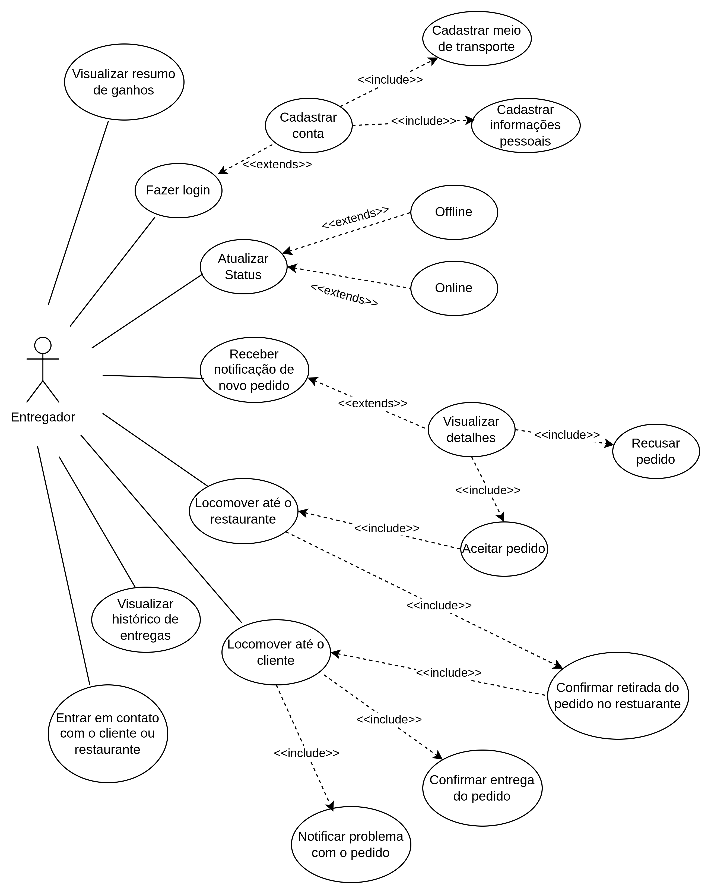

# 2.3.3 Caso de uso Entregador

## Introdução

TODO

## Metodologia

TODO

**Tabela 1**: Integrantes

| Matrícula | Nome                |
| --------- | ------------------- |
| 211061805 | Guilherme Westphall |
| 231032121 | Wolfgang Friedrich  |
| 221034973 | Bruno Vasconcelos   |

**Autor**: [Guilherme Westphall](https://github.com/west7)

**Tabela 2**: Especificação de Caso de Uso

| ID    | Caso de Uso                                          |
| ----- | ---------------------------------------------------- |
| UCE01 | Fazer Login                                          |
| UCE02 | Cadastrar Conta                                      |
| UCE03 | Atualizar Status de Disponibilidade (Online/Offline) |
| UCE04 | Receber Notificação de Novo Pedido                   |
| UCE05 | Visualizar Detalhes do Pedido                        |
| UCE06 | Aceitar ou Recusar Pedido                            |
| UCE07 | Navegar até o Restaurante                            |
| UCE08 | Confirmar Retirada do Pedido no Restaurante          |
| UCE09 | Navegar até o Cliente                                |
| UCE10 | Confirmar Entrega do Pedido                          |
| UCE11 | Visualizar Histórico de Entregas                     |
| UCE12 | Visualizar Resumo de Ganhos                          |
| UCE13 | Entrar em Contato com o Cliente ou Restaurante       |
| UCE14 | Reportar Problema com o Pedido                       |
| UCE15 | Cadastrar Forma de transporte                        |

**Autor**: [Guilherme Westphall](https://github.com/west7)

## Diagrama

**Figura 1**: Diagrama de casos de uso do Entregador

**Autor(es)**:  [Guilherme Westphall](https://github.com/west7), [Bruno Cunha Vasconcelos de Araújo](https://github.com/brunocva), [Wolfgang Friedrich Stein](https://github.com/Wolffstein)

## Especificações

<!-- TODO -->

### UCE01 - Fazer Login

| Elemento              | Descrição                                                                                                                                                                                                                                                                                                                                                                                                                                                                                             |
| --------------------- | ----------------------------------------------------------------------------------------------------------------------------------------------------------------------------------------------------------------------------------------------------------------------------------------------------------------------------------------------------------------------------------------------------------------------------------------------------------------------------------------------------- |
| **Caso de Uso**       | UCE01 - Fazer Login                                                                                                                                                                                                                                                                                                                                                                                                                                                                                   |
| **Descrição**         | O entregador acessa o aplicativo por meio da ação de login                                                                                                                                                                                                                                                                                                                                                                                                                                            |
| **Requisitos**        | R04                                                                                                                                                                                                                                                                                                                                                                                                                                                                                                   |
| **Atores**            | Entregador                                                                                                                                                                                                                                                                                                                                                                                                                                                                                            |
| **Frequência de Uso** | Alta                                                                                                                                                                                                                                                                                                                                                                                                                                                                                                  |
| **Pré-condições**     | - Um telefone celular com conexão com a internet.  - O aplicativo HungryHub baixado no telefone celular.                                                                                                                                                                                                                                                                                                                                                                                           |
| **Fluxo Principal**   | - O entregador liga o telefone ligado a internet.   - O entregador abre o aplicativo HungryHub.   - O usuaŕio insere as informações de email cadastrado e senha associada ao email cadastrado.  - O entregador clica no botão de "Entrar".                                                                                                                                                                                                                                                   |
| **Fluxo Alternativo** | - O entregador liga o telefone conectado a internet.   - O entregador abre o aplicativo HungryHub.   - O entregador clica no botão "Cadastrar-se".   - O entregador insere as informações requeridas pelo aplicativo.   - O entregador valida o email.   - O entregador volta para a tela de Login.  - O usuaŕio insere as informações de email cadastrado e senha associada ao email cadastrado.  - O entregador clica no botão de "Entrar"                                     |
| **Fluxo de Exceção**  | - O entregador erra sua senha.   - O entregador recebe um erro em veremelho de "Senha incorreta".  - O entregador clica em "Esqueci minha senha".   - O entregador pede um email para redefinir a senha.  - O entregador redefine sua senha no email enviado pelo HungryHub.   - O entregador retorna para a tela de Login.   - O entregador insere as informaçoes de email cadastrado e a nova senha associada ao email cadastrado.  - O entregador clica no botão de "Entrar". |
| **Pós-condições**     | O entregador consegue acessar o aplicativo pelo seu perfil.                                                                                                                                                                                                                                                                                                                                                                                                                                           |
| **Data da Criação**   | 28/11/2024                                                                                                                                                                                                                                                                                                                                                                                                                                                                                            |

**Autor**: [Guilherme Westphall](https://github.com/west7)

### UCE02 - Cadastrar Conta

| **Elemento**          | **Descrição**                                                                                                                                                                                                                                                                                                                                                                                                                                                                                          |
| --------------------- | ------------------------------------------------------------------------------------------------------------------------------------------------------------------------------------------------------------------------------------------------------------------------------------------------------------------------------------------------------------------------------------------------------------------------------------------------------------------------------------------------------ |
| **Caso de Uso**       | UCE02 - Cadastrar Conta                                                                                                                                                                                                                                                                                                                                                                                                                                                                                |
| **Descrição**         | O entregador realiza o cadastro no aplicativo HungryHub para criar uma conta.                                                                                                                                                                                                                                                                                                                                                                                                                          |
| **Requisitos**        | R02                                                                                                                                                                                                                                                                                                                                                                                                                                                                                                    |
| **Atores**            | Entregador                                                                                                                                                                                                                                                                                                                                                                                                                                                                                             |
| **Frequência de Uso** | Média                                                                                                                                                                                                                                                                                                                                                                                                                                                                                                  |
| **Pré-condições**     | - Um telefone celular com conexão à internet.  - O aplicativo HungryHub baixado no telefone celular.                                                                                                                                                                                                                                                                                                                                                                                                |
| **Fluxo Principal**   | - O entregador liga o telefone conectado à internet.  - O entregador abre o aplicativo HungryHub.  - O entregador clica no botão "Cadastrar-se".  - O entregador insere as informações obrigatórias (nome, email, senha, número de telefone).  - O entregador clica em "Finalizar Cadastro".  - O sistema envia um email de validação ao endereço informado.  - O entregador valida o email clicando no link enviado.  - O sistema confirma o cadastro e retorna à tela de login. |
| **Fluxo Alternativo** | - O entregador clica em "Cadastrar-se".  - O entregador insere apenas algumas informações obrigatórias.  - O sistema apresenta uma mensagem de erro informando os campos obrigatórios que faltam ser preenchidos.  - O entregador corrige os campos e clica em "Finalizar Cadastro".  - O fluxo principal é retomado.                                                                                                                                                                      |
| **Fluxo de Exceção**  | - O entregador insere um email já cadastrado.  - O sistema apresenta uma mensagem de erro informando que o email já está em uso.  - O entregador utiliza outro email e clica em "Finalizar Cadastro".  - O sistema detecta problemas na validação do email enviado (ex.: link expirado).  - O sistema permite que o entregador solicite o reenvio do email de validação.                                                                                                                   |
| **Pós-condições**     | O entregador tem uma conta cadastrada no aplicativo HungryHub e pode utilizá-la para fazer login.                                                                                                                                                                                                                                                                                                                                                                                                      |
| **Data da Criação**   | 28/11/2024                                                                                                                                                                                                                                                                                                                                                                                                                                                                                             |

**Autor**: [Guilherme Westphall](https://github.com/west7)

### UCE03 - Atualizar Status de Disponibilidade Online/Offline

| **Elemento**          | **Descrição**                                                                                                                                                                                                                                                                                                                                                                  |
| --------------------- | ------------------------------------------------------------------------------------------------------------------------------------------------------------------------------------------------------------------------------------------------------------------------------------------------------------------------------------------------------------------------------ |
| **Caso de Uso**       | UCE03 - Atualizar Status de Disponibilidade Online/Offline                                                                                                                                                                                                                                                                                                                     |
| **Descrição**         | O entregador atualiza seu status de disponibilidade para indicar se está pronto para receber pedidos.                                                                                                                                                                                                                                                                          |
| **Requisitos**        | R31                                                                                                                                                                                                                                                                                                                                                                            |
| **Atores**            | Entregador                                                                                                                                                                                                                                                                                                                                                                     |
| **Frequência de Uso** | Alta                                                                                                                                                                                                                                                                                                                                                                           |
| **Pré-condições**     | - Um telefone celular com conexão à internet.  - O entregador deve estar logado no aplicativo HungryHub.                                                                                                                                                                                                                                                                    |
| **Fluxo Principal**   | - O entregador acessa o aplicativo HungryHub após fazer login.  - O entregador acessa o painel de controle principal.  - O entregador clica no botão de alternância de disponibilidade.  - O sistema atualiza o status para "Online" (se o entregador estava Offline) ou "Offline" (se o entregador estava Online).  - O sistema confirma a atualização do status. |
| **Fluxo Alternativo** | - O entregador tenta mudar o status, mas a conexão com a internet é interrompida.  - O sistema exibe uma mensagem de erro informando que não foi possível atualizar o status devido à falta de conexão.  - O entregador restaura a conexão e tenta novamente, retomando o fluxo principal.                                                                               |
| **Fluxo de Exceção**  | - O entregador tenta mudar o status, mas ocorre um erro interno no servidor.  - O sistema exibe uma mensagem de erro e não atualiza o status.  - O entregador pode tentar novamente mais tarde ou entrar em contato com o suporte.                                                                                                                                       |
| **Pós-condições**     | O status de disponibilidade do entregador é atualizado corretamente no sistema, refletindo sua prontidão para aceitar pedidos.                                                                                                                                                                                                                                                 |
| **Data da Criação**   | 28/11/2024                                                                                                                                                                                                                                                                                                                                                                     |

**Autor**: [Guilherme Westphall](https://github.com/west7)

### UCE04 - Receber Notificação de Novo Pedido

| **Elemento**          | **Descrição**                                                                                                                                                                                                                                                                                                   |
| --------------------- | --------------------------------------------------------------------------------------------------------------------------------------------------------------------------------------------------------------------------------------------------------------------------------------------------------------- |
| **Caso de Uso**       | UCE04 - Receber Notificação de Novo Pedido                                                                                                                                                                                                                                                                      |
| **Descrição**         | O entregador recebe uma notificação no aplicativo informando sobre um novo pedido disponível para entrega.                                                                                                                                                                                                      |
| **Requisitos**        | R28, R31                                                                                                                                                                                                                                                                                                        |
| **Atores**            | Entregador                                                                                                                                                                                                                                                                                                      |
| **Frequência de Uso** | Alta                                                                                                                                                                                                                                                                                                            |
| **Pré-condições**     | - Um telefone celular com conexão à internet.  - O entregador deve estar logado no aplicativo HungryHub.  - O status de disponibilidade do entregador deve estar como "Online".                                                                                                                           |
| **Fluxo Principal**   | - O sistema identifica um pedido disponível próximo à localização do entregador.  - O sistema envia uma notificação push ao telefone do entregador.  - O entregador clica na notificação.                                                                                                                 |
| **Fluxo Alternativo** | O entregador está usando o aplicativo quando o sistema identifica um novo pedido.  - O sistema exibe diretamente uma mensagem na interface principal do aplicativo informando sobre o novo pedido.  - O entregador visualiza a notificação do pedido sem precisar clicar em uma notificação externa.   |
| **Fluxo de Exceção**  | - O entregador não recebe a notificação devido a problemas de conexão com a internet.  - O entregador restaura a conexão com a internet.  - O fluxo principal é retomado.                                                                                                                                 |
| **Pós-condições**     | O entregador visualiza a oportunidade de um novo pedido e pode aceitar ou recusar a entrega.                                                                                                                                                                                                                    |
| **Data da Criação**   | 28/11/2024                                                                                                                                                                                                                                                                                                      |

**Autor**: [Guilherme Westphall](https://github.com/west7)

### UCE05 - Visualizar Detalhes do Pedido

| **Elemento**          | **Descrição**                                                                                                                                                                                                                                                                                                                                                                                                                |
| --------------------- | ---------------------------------------------------------------------------------------------------------------------------------------------------------------------------------------------------------------------------------------------------------------------------------------------------------------------------------------------------------------------------------------------------------------------------- |
| **Caso de Uso**       | UCE05 - Visualizar Detalhes do Pedido                                                                                                                                                                                                                                                                                                                                                                                        |
| **Descrição**         | O entregador acessa os detalhes de um pedido recebido para entender as informações necessárias para a entrega.                                                                                                                                                                                                                                                                                                               |
| **Requisitos**        | -                                                                                                                                                                                                                                                                                                                                                                                                                            |
| **Atores**            | Entregador                                                                                                                                                                                                                                                                                                                                                                                                                   |
| **Frequência de Uso** | Alta                                                                                                                                                                                                                                                                                                                                                                                                                         |
| **Pré-condições**     | - O entregador deve estar logado no aplicativo HungryHub.  - O entregador deve ter recebido a notificação de um pedido.                                                                                                                                                                                                                                                                                                        |
| **Fluxo Principal**   | - O entregador abre o aplicativo HungryHub após ter recebido uma notificação.  - O entregador acessa a seção de "Pedidos Recebidos".  - O entregador seleciona um pedido na lista de pedidos.  - O sistema exibe os detalhes do pedido, incluindo: nome e endereço do restaurante, nome e endereço do cliente, lista de itens do pedido,   valor total do pedido, tempo estimado para entrega e o valor da entrega. |
| **Fluxo Alternativo** | - O entregador clica na notificação de um novo pedido diretamente.  - O sistema abre os detalhes do pedido na tela principal do aplicativo.  - O entregador visualiza as informações sem acessar a lista de "Pedidos Recebidos".                                                                                                                                                                                       |
| **Fluxo de Exceção**  | - O entregador tenta acessar os detalhes do pedido, mas ocorre um erro de comunicação com o servidor.  - O sistema exibe uma mensagem de erro e recomenda tentar novamente mais tarde.  - O entregador pode verificar a conexão e retomar o fluxo principal.                                                                                                                                                           |
| **Pós-condições**     | O entregador obtém todas as informações necessárias para iniciar a entrega do pedido.                                                                                                                                                                                                                                                                                                                                        |
| **Data da Criação**   | 28/11/2024                                                                                                                                                                                                                                                                                                                                                                                                                   |

**Autor**: [Guilherme Westphall](https://github.com/west7)

## Referências

1. Caso de Uso – Include, Extend e Generalização, ATÉ O MOMENTO. Disponível em: https://www.ateomomento.com.br/caso-de-uso-include-extend-e-generalizacao/. Acessado em 27 de novembro de 2024.

## Histórico de versões

| Versão | Data da alteração | Comentário                                       | Autor(es)                                       | Revisor(es) | Data de revisão |
| ------ | ----------------- | ------------------------------------------------ | ----------------------------------------------- | ----------- | --------------- |
| 1.0    | 28/11/2024        | Criação do documento                             | [Guilherme Westphall](https://github.com/west7) |             |                 |
| 1.1    | 28/11/2024        | Adiciona o diagrama                              | [Guilherme Westphall](https://github.com/west7) |             |                 |
| 1.2    | 28/11/2024        | Adiciona especificações dos casos UCE01 ao UCE05 | [Guilherme Westphall](https://github.com/west7) |             |                 |
